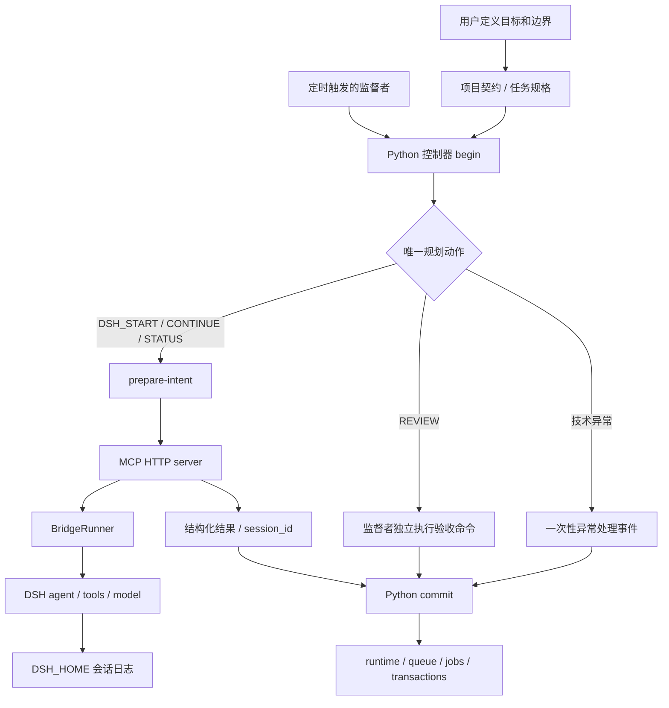

# 系统如何协作

## 三层职责



1. **监督者**：解释目标、选择技术方案、调用执行器、独立验收。LUNA/SOL 是原工作流的内部角色代码。
2. **Python 控制器**：校验契约、持有单写者租约、规划一个动作、持久化副作用意图和可恢复事务。它不调用模型。
3. **Node bridge + MCP**：MCP server 提供工具协议；BridgeRunner 管理 epoch 与 DSH 会话；DSH 负责模型上下文、实际工具执行和会话日志。

bridge 与 MCP server 是一个进程内的不同模块，不需要再启动第二个“DSH MCP 服务”。DSH 的上游 MCP client 插件是另一概念；本仓库发布的是让监督者调用 DSH 的 MCP server。

## 一轮完整执行

以下所有控制器命令都在控制工作区运行。使用 Python 或 PowerShell 包装器均可。

```sh
python control/supervisor_ctl.py begin --role LUNA
```

保存返回的 `lease_token`、`expected`、`request_path` 和 `planned_action`。如果计划是 `DSH_START`：

```sh
python control/supervisor_ctl.py prepare-intent --token <lease_token>
```

保存返回的 `intent.intent_id` 与 `correlation_id`。向 MCP 发起 `dsh_start_task`，输入内容来自实际 specification，带上 correlation ID，并使用规划动作里的 workspace 和 mode。例如工具参数形状：

```json
{
  "task": "correlation_id=<实际值>；执行 first-job 的已批准规格，按原始命令验证，报告证据。",
  "workspace": "/absolute/path/to/my-app",
  "mode": "implement"
}
```

当 bridge 返回 `running` 时，把真实结果写入 `request_path`；将下列占位内容替换为本轮值，不应原样提交：

```json
{
  "job_id": "first-job",
  "expected": {"原样复制本轮 begin.expected": "不可使用旧轮的 revision"},
  "patches": {
    "job": {
      "status": "RUNNING",
      "dsh": {
        "session_id": "<MCP 返回的 session_id>",
        "lifecycle_status": "running",
        "continuation_required": false,
        "last_checked_at": "<实际 UTC 时间>",
        "last_result_summary": "本轮派发已接受，epoch 仍在执行"
      }
    }
  },
  "resolve_intent": {
    "intent_id": "<实际 intent_id>",
    "external_id": "<同一个 session_id>",
    "outcome": "DISPATCHED",
    "summary": "已记录 MCP 返回的 session"
  },
  "finish": {"outcome": "DSH_RUNNING", "summary": "任务开始运行"}
}
```

最后提交并结束本轮：

```sh
python control/supervisor_ctl.py commit --token <lease_token> --request <request_path>
```

下一轮 `begin` 根据时间和状态规划查询。`dsh_get_status` 返回 completed 后，提交 `REVIEW_PENDING` 与 `dsh.lifecycle_status=completed`；如果 start/continue 当场返回 waiting_for_review，也进入待验收路径。下一轮 REVIEW 独立运行验收命令，全部通过并形成 V8_1 验收记录后才 ACCEPT。字段详情见 [commit guide](../control/commit-request-guide.md)。

## 两套状态不要混淆

| 层级 | 状态 | 含义 |
| --- | --- | --- |
| start/continue 返回 | `running` | 等待上限已到，后台仍在执行 |
| start/continue 返回 | `waiting_for_review` | 该 epoch 已结束，等待监督者审查 |
| get_status 返回 | `completed` | 该 epoch 已结束，可在 last_result 取结果 |
| 控制器 job | `REVIEW_PENDING` | 尚未通过独立验收 |
| 控制器 job | `ACCEPTED` | 已提交合格的验收证据 |
| 控制器 job | `ARCHIVED` | 接受后已交接/出队 |

模型回复“完成”、MCP 返回 completed、测试摘要列出 passed，都不能单独证明 job 已通过验收。bridge 的 tests/changed_files 来自工具日志的有限摘要，可能不完整；最终判据仍是规格要求的独立验证。

## 故障与持久化边界

- Python 的 transactions/intents 属于控制平面恢复证据；保存状态 hash 不代表能回滚任意外部代码修改。
- bridge 的 registry、last_result 和 per-session lock 目前在内存；`list_sessions` 只列当前进程见过的会话。
- DSH 持久化自己的 session 日志。已知 session ID 可经 continue 尝试恢复；这会追加新反馈并开始一个新 epoch，不是只读恢复按钮。
- bridge 重启后未知 start 的 session 不能靠 list_sessions 自动从磁盘找回。控制器必须保留 intent 并交给异常处理，不能重新 start 猜测性补偿。
- `DSH_BRIDGE_EPOCH_TIMEOUT_MS=45000` 是 MCP 调用等待上限，不是模型运行总预算；设为 0 会一直等到 epoch 结束，不适合短心跳。
- 业务门禁约束协作协议，不能代替 DSH 权限、账户限额或系统沙箱；外部调用后的不确定性并未被完全消除。
